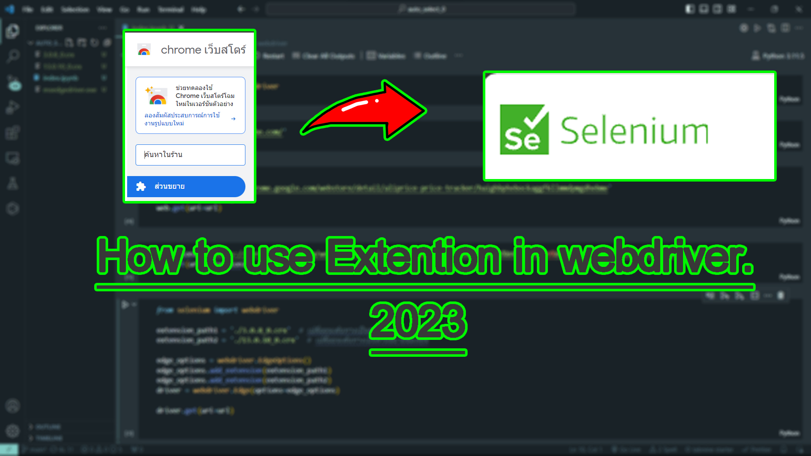

# webdriver-Extentions-python-2023
How use Extentions in Webdriver on python selenium

<a href="https://youtu.be/RPintA3sL0w">See to Video : How to use Extention google store to webdriver 2023</a>

  

<pre>
1.Download Extention on any Broser.
  1.1.get https://chrome.google.com/webstore/category/extensions
  1.2.add extention
  1.3.get url edge://extensions/ or Chrome://extensions/
  1.4.open mode developer
  
  1.5.copy your extention
2.open file Explorer on your PC
  2.1.get path 
    2.1.1. Microsoft Egde --> C:\Users\{Username}\AppData\Local\Microsoft\Edge\User Data\Default\Extensions
    2.1.2. Google Chrome --> C:\Users\{Username}\AppData\Local\Google\Chrome\User Data\Default\Extensions
  2.2.ctrl+f and ctrl+v search extention and copy file
3.Load Extention 
  3.1.get url edge://extensions/ or Chrome://extensions/
  3.2.open mode developer
  3.3.packe Extention // แพ็คส่วนขยาย
  3.4.Download one by one Extention select pack Extention and path to you copy file
  3.5.sele path and Download
4.Use Extention to webdriver
  4.1.open file choice 3.5
  4.2.copy file .crx and paste(ctrl+v) to Project webdriver
</pre>
